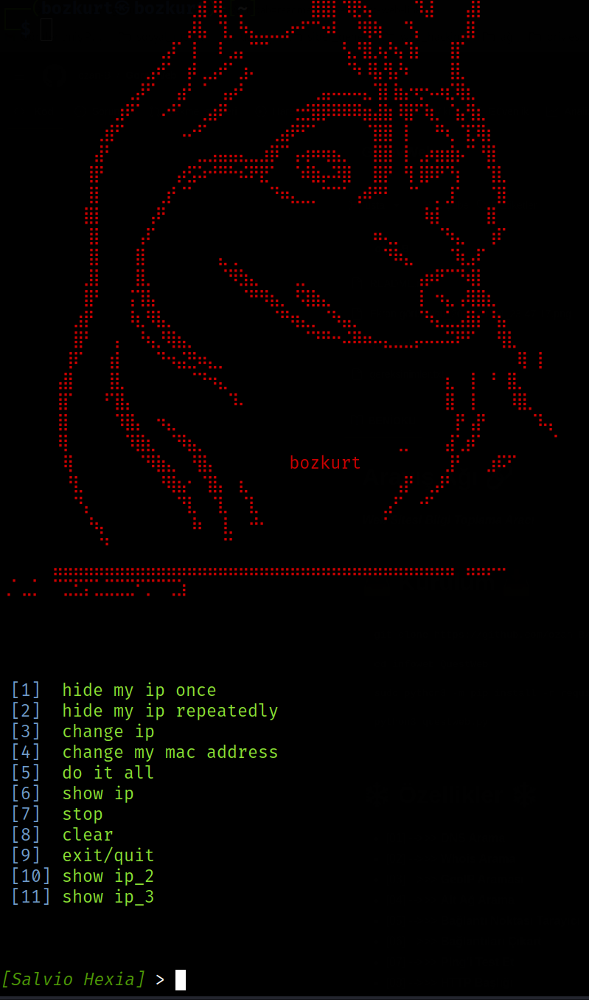
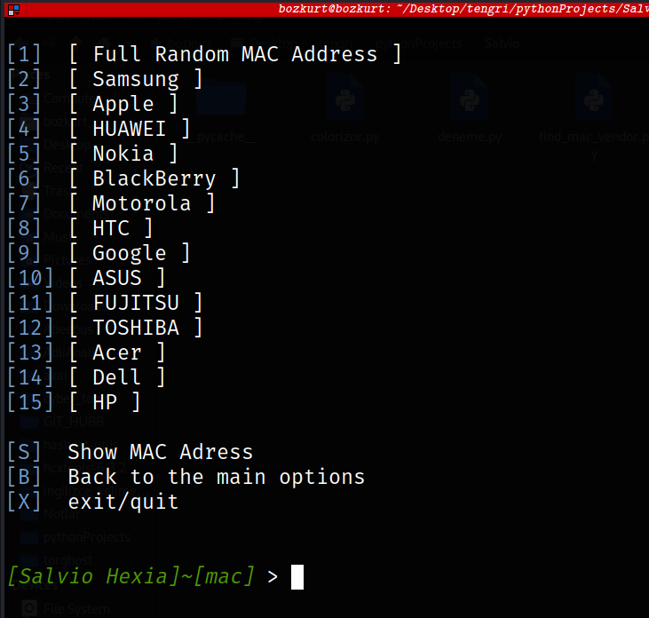

# Salvio :link:	

__*IP address and Mac address hiding tool*__ :wrench:	

- Salvio is a tool to automate [anonsurf] and [macchanger] to redirect all traffic on your device to TOR and spoof your mac address with one click. It can also change your IP by a certain amount, for example every 1 or 10 seconds.
*************

# :computer: Installation :computer:

    git clone https://github.com/ozan-B/Salvio.git

    cd  Salvio

    chmod +x 

    sudo bash install.sh

    chmod +x ip_show.sh

    sudo python3 Salvio.py 

****************
# :snowflake:	 Features :snowflake:	

- Redirect all the traffic to TOR network. :onion:
- The Ability to change your IP address every  seconds. :timer_clock:
- Customize your MAC Address to a Certain vendor like [Samsung,Apple,etc..].
- Show your public ip.

***************

# :dart:	:dart:	:dart:	Overview of the Main Window  :dart::dart:	:dart:	

**[1]**   **hide my ip once**
**[2]**   **hide my ip repeatedly**
**[3]**   **change ip**
**[4]**   **change my mac address**
**[5]**   **do it all**
**[6]**   **show ip**
**[7]**   **stop**
**[8]**   **clear**
**[9]**   **exit/quit**
**[10]**  **show ip_2**
**[11]**  **show ip_3**

-------

# :eye_speech_bubble:	 mac address change overview :eye_speech_bubble:	

        [1]  [ Full Random MAC Address ]
        [2]  [ Samsung ]
        [3]  [ Apple ]
        [4]  [ HUAWEI ]
        [5]  [ Nokia ]
        [6]  [ BlackBerry ]
        [7]  [ Motorola ]
        [8]  [ HTC ]
        [9]  [ Google ]
        [10] [ ASUS ]
        [11] [ FUJITSU ]
        [12] [ TOSHIBA ]
        [13] [ Acer ]
        [14] [ Dell ]
        [15] [ HP ]

        [S]  Show MAC Adress
        [B]  Back to the main options
        [X]  exit/quit

------------
# :camera_flash:  Screenshot   :camera_flash:

